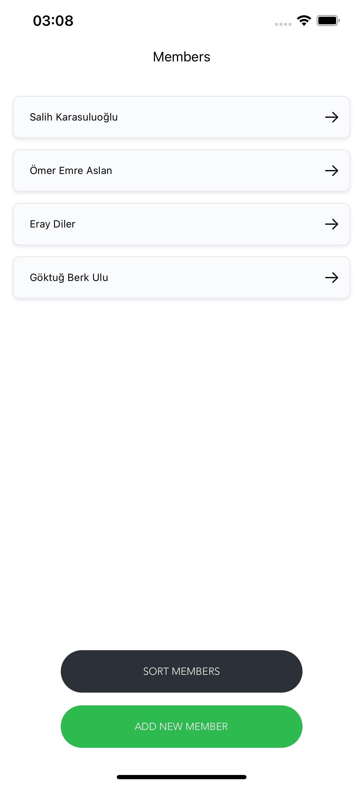
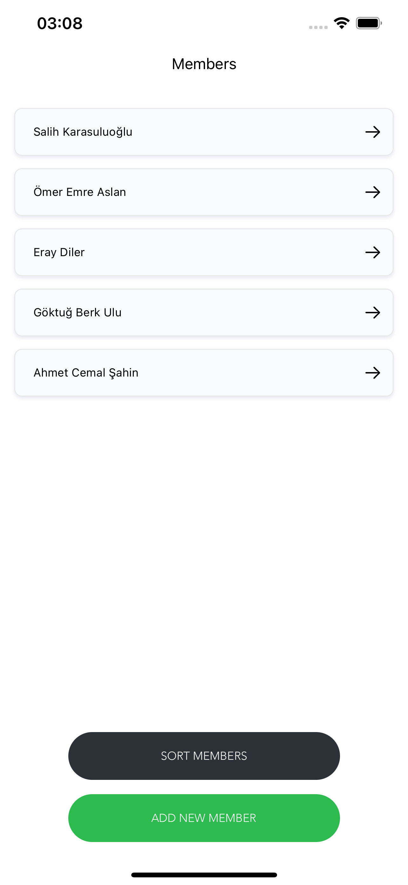
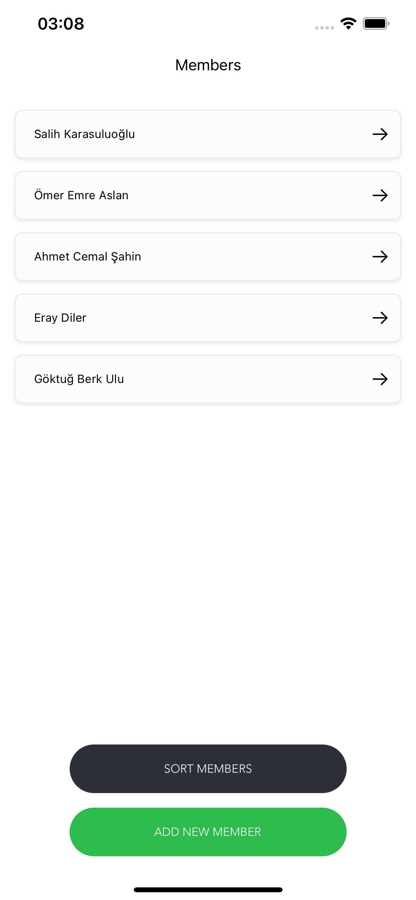

<h1 align='center'>HipoApp</h1>

  This app is made for Hipo Internship Program, it is a full programmatically UIKit application

  Steps that I followed to complete this project:
* Build the main project with MVC Pattern
* Add a 3rd Party Library --> [*SnapKit*](https://github.com/SnapKit/SnapKit)
* Construct the view hierarchy --> *Header, TableView and 2 Buttons*
* Add necessary constraints to the views
* Design a custom button --> *class CustomButton: UIButton*
* Design a table view --> *class MemberTableView: UITableView*
* Design a table cell --> *class MemberTableViewCell: UITableViewCell*
* Create a database class --> *class Database*
* Fetch data & show it in table view
* Make functional "Add Button"

* Write Extension for String*
  * *A String extension function that will help you count the number of occurrences of a character in a string*
  
* Write a sorting algorithm* for "Sort Button"
  * *A function that will receive an array of strings and a character. This function will be responsible for sorting members in the array with respect to following rules:*
    1. *By using the extension function you wrote, find the most occurences of the character for each string in the array and sort in descending order.*
    2. *If two or more strings contain the same amount for the character, sort these according to their length.*
    3. *If two or more strings contain the same amount for the character and have the same length, sort these in alphabetical order.*

First List| Add Member | After Sorting
------------ | ------------- | -------------
 |  |  |

